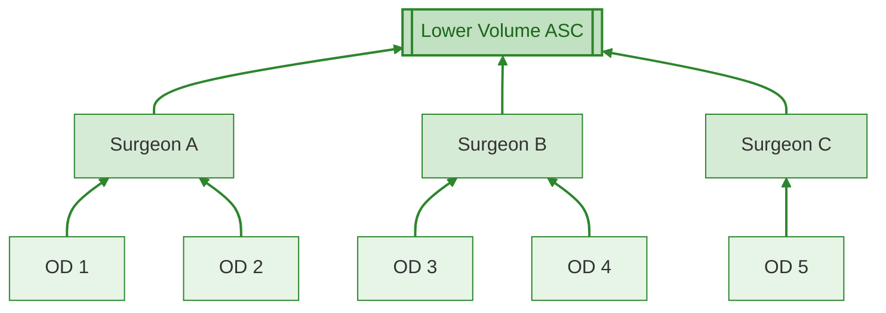
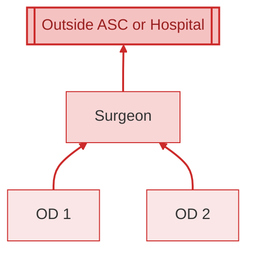

# Organizational Models

## 1. High-Volume ASC Model (HIGH vertical integration with 40 total referring ODs)

```mermaid
flowchart BT
  CFS_ASC[["Center For Sight ASC"]]
  style CFS_ASC fill:#b3d1ff,stroke:#0052cc,stroke-width:2px,color:#003380
  
  Surgeon1["Surgeon 1"]
  Surgeon2["Surgeon 2"]
  Surgeon3["Surgeon 3"]
  Surgeon4["Surgeon 4"]
  Surgeon5["Surgeon 5"]
  style Surgeon1 fill:#cce0ff,stroke:#0052cc,stroke-width:1px
  style Surgeon2 fill:#cce0ff,stroke:#0052cc,stroke-width:1px
  style Surgeon3 fill:#cce0ff,stroke:#0052cc,stroke-width:1px
  style Surgeon4 fill:#cce0ff,stroke:#0052cc,stroke-width:1px
  style Surgeon5 fill:#cce0ff,stroke:#0052cc,stroke-width:1px
  
  OD1[["ODs 1-3"]]
  OD2[["ODs 4-5"]]
  OD3[["ODs 6-8"]]
  OD4[["ODs 9-10"]]
  OD5[["ODs 3-5"]]
  OD6[["ODs 11-15"]]
  OD7[["ODs 16-18"]]
  OD8[["ODs 19-21"]]
  OD9[["ODs 12-13"]]
  OD10[["OD 22-25"]]
  OD_more[["ODs 26-29"]]
  OD40[["OD 30-40"]]
  style OD1 fill:#e6f0ff,stroke:#0052cc,stroke-width:2px
  style OD2 fill:#e6f0ff,stroke:#0052cc,stroke-width:2px
  style OD3 fill:#e6f0ff,stroke:#0052cc,stroke-width:2px
  style OD4 fill:#e6f0ff,stroke:#0052cc,stroke-width:2px
  style OD5 fill:#e6f0ff,stroke:#0052cc,stroke-width:2px
  style OD6 fill:#e6f0ff,stroke:#0052cc,stroke-width:2px
  style OD7 fill:#e6f0ff,stroke:#0052cc,stroke-width:2px
  style OD8 fill:#e6f0ff,stroke:#0052cc,stroke-width:2px
  style OD9 fill:#e6f0ff,stroke:#0052cc,stroke-width:2px
  style OD10 fill:#e6f0ff,stroke:#0052cc,stroke-width:2px
  style OD_more fill:#e6f0ff,stroke:#0052cc,stroke-width:2px
  style OD40 fill:#e6f0ff,stroke:#0052cc,stroke-width:2px
  
  Legend[["Double border = Represents multiple providers"]]
  style Legend fill:#f0f0f0,stroke:#333,stroke-width:2px,color:#333
  
  Surgeon1 --> CFS_ASC
  Surgeon2 --> CFS_ASC
  Surgeon3 --> CFS_ASC
  Surgeon4 --> CFS_ASC
  Surgeon5 --> CFS_ASC
  
  OD1 --> Surgeon1
  OD2 --> Surgeon1
  OD3 --> Surgeon1
  OD4 --> Surgeon1
  OD5 --> Surgeon2
  OD6 --> Surgeon2
  OD7 --> Surgeon2
  OD8 --> Surgeon3
  OD9 --> Surgeon3
  OD10 --> Surgeon3
  OD_more --> Surgeon4
  OD40 --> Surgeon5
  
  linkStyle default stroke:#0052cc,stroke-width:2px
```

## 2. Lower-Volume ASC Model (some vertical integration with 5 total referring ODs)

## 3. Least-Profitable Model (No ASC, low-volume, low vertical integration, 2 referring ODs)

# Strategic Priorities for US Eye

**Strategic Priority 1: Preserve and Expand Vertically Integrated Model 1**
- Maintain high-volume surgeon-to-ASC pipelines.
- Ensure robust OD referral base (target: 5-10 ODs per surgeon, including internal and external).
- Retain ownership and control of ASCs (major revenue driver and ensures efficient operations)
- Focus on premium service lines (e.g., premium IOLs and refractive cataract surgery).

**Strategic Priority 2: Protect Patient Experience and Community Goodwill**
- Avoid cuts that affect the quality of care or trust in local markets.
- Sustain surgeon and OD satisfaction to retain high referral volumes.
- Maintain and improve brand reputation in all regions

**Strategic Priority 3: Cut Costs and Drive Synergies (The Private Equity Approach), BUT Without Undermining Priorities 1 and 2**
- Consolidate support services and reduce redundancy—but not at the expense of surgical throughput or patient satisfaction.
- Be selective in acquisition strategy: avoid practices that structurally diverge from Model 1 unless a clear integration plan is set.
- Control number of outstanding shares and debt levels; acquisitions should enhance, not dilute, per-share earnings.

---

# Growth Risk Warning

**Acquisition of lower-performing models (Model 2 and 3) may:**
- Dilute earnings per share.
- Increase leverage in a high-interest-rate environment.
- Reduce overall profitability and revenue growth unless tightly integrated post-acquisition.

---